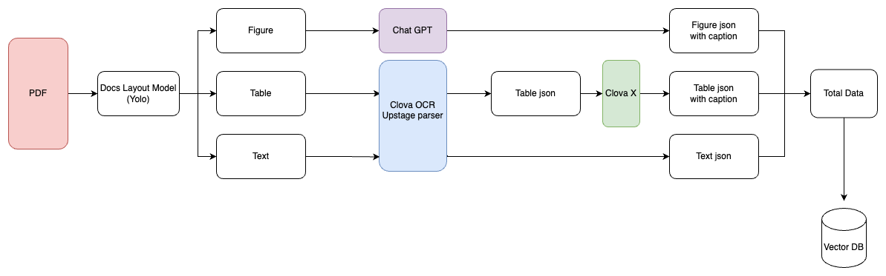

# Level 4. 증권사 자료 기반 주식 LLM 서비스

---

# **프로젝트 개요**

### **프로젝트 주제**

1. 주제
   - 증권사 자료 기반 주식 LLM 서비스 개발
2. 요구사항
   - PDF 문서로부터 텍스트, 그래프 등 정보의 추출
   - 데이터 레포지토리 구축(GraphDB, VectorDB 등)
   - 쿼리에 대해 가장 적합한 데이터를 찾아내는 RAG 시스템 구현
   - 프롬프트 개발
   - 답변 생성
   - Q&A 기능: 정량평가 목적
     - REST API 로 구현
     - Input: query(질의)
     - Output: context(참조텍스트), answer(답변)

### **데이터셋**

1. 제공된 데이터
   - 증권사 자료 파일(PDF) 100개

### **평가 방법**

1. 정량평가 50%
   - 테스트셋 질의에 대한 답변 성능 – 지표 G-Eval
2. 정성평가 50%
   - 서비스의 창의성, 유용성, 개발 완성도, 소스코드 품질, 문서화 수준

<br>

# **👨🏻‍💻 팀원 소개 및 역할**

<div align='center'>

|                                                          이름                                                          |                       프로필                       |                             역할                              |
| :--------------------------------------------------------------------------------------------------------------------: | :------------------------------------------------: | :-----------------------------------------------------------: |
| 권기태 [](https://github.com/starlike6617) | </img> |     API 설계 및 개발, RESTful API 구현, OCR 데이터 후처리     |
|  권유진 [](https://github.com/0618yujin)   | </img> | 평가 데이터 제작, OCR 데이터 후처리, Web Design 및 발표 자료  |
|    박무재 [](https://github.com/Mujae)     | </img> | RAG 파이프라인 구현, 평가 코드 구현 및 실험, 평가 데이터 선별 |
|  박정미 [](https://github.com/imJeongmi)   | </img> |        평가 데이터 제작, OCR 데이터 후처리, Front-end         |
|   이용준 [](https://github.com/elwhyjay)   | </img> |       PM, 리팩토링 및 기타 구현, 아키텍쳐 설계 및 서빙        |
|  정원식 [](https://github.com/wonsjeong)   | </img> |    DocLayout 모듈 구현, Embedding Model, Fine Tuning, 발표    |

</div>
<br>

# 프로젝트 수행 방법

## 1. PDF OCR

📑 **[PDF OCR 상세 설명 보기](PDF_OCR/README.MD)**


### 1.1 실행
```bash
python pdf_parser.py -i "./pdf/input_pdf_folder"
python data_postprocessor.py
```

## 2. RAG

📑 **[RAG 상세 설명 보기](app/RAG/README.md)**

### 2.1 실행

```bash
cd app/RAG

# retrieval 평가
python main.py mode=retrieve

# generator 평가
python main.py mode=generate

# vectordb 생성 및 업데이트
python main.py mode=update_vectordb
```

### 2.2 평가 데이터 구축

- 목적
  - Retriever의 Top-K Accuracy 평가 및 Retriever, Generator의 G-Eval 평가 수행
- 방법
  - **질문 생성**: GPT를 활용하여 PDF에서 각 종목의 증권사마다 text 기반 질문 10개씩 생성
  - **Query 정제**: 각 종목별로 100개의 Query를 생성한 후, 중복을 제거하여 최종 Query 선정
  - **답변 추출**: 정제된 Query를 각 증권사 리포트에 적용하여 answers 도출
  - **Ground Truth 강화**: 종목별로 다양한 증권사(5~6개)를 선정하여 Ground Truth의 품질 향상
  - **표&그림 질문 추가**: 표와 그림을 기반으로 한 질문을 10개 추가 생성
- 활용
  - Retrieval Top-K Accuracy에는 전체 1,843개 활용
  - G-Eval 평가는 1,843개 중 75개 샘플 사용

### 2.3 Embedding Model 평가

|  | Top_1 | Top_5 | Top_10 | Top_20 | Top_30 | Top_50 |
| --- | --- | --- | --- | --- | --- | --- |
| TF-IDF | 9.80 | 22.55 | 37.52 | 59.89 | 72.64 | 90.94 |
| BM25 | 12.20 | 28.84 | 42.33 | 63.59 | 79.85 | 96.12 |
| klue/roberta-large | 2.40 | 11.46 | 20.89 | 38.26 | 59.15 | 86.88 |
| klue/bert base | 5.73 | 17.38 | 30.50 | 49.35 | 66.73 | 87.62 |
| multilingual-e5-large-instruct | 11.09 | 29.94 | 44.92 | 66.17 | 80.41 | 94.82 |
| nlpai-lab/KoE5 | 15.16 | 38.26 | 53.42 | 71.72 | 81.52 | 93.53 |
| BAAI/bge-m3 | 15.34 | 41.22 | 56.38 | 73.94 | 84.84 | 96.30 |
| nlpai-lab/KURE-v1 | 16.64 | 42.41 | 58.41 | 76.53 | 85.03 | 95.38 |

nlpai-lab의 KoE5와 KURE-v1이 우수한 성능을 보였다. 실제 문서를 검토한 결과 특정 Query에 대한 검색 성능이 더 뛰어난 KoE5를 최종 모델로 선택하였다.
### 2.4 Embedding Model Fine-Tuning

- Fine-tuning 데이터: [virattt/financial-qa-10K](https://huggingface.co/datasets/virattt/financial-qa-10K)를 번역한 데이터
- Query Encoder와 Passage Encoder를 나누어 Hard Negative 없이 In-Batch Negatives 방식으로 Multiple Negatives Ranking Loss을 사용하여 학습
- 결과(Top-K Accuracy)
    
    
    |  | KoE5 | Fine-Tuned Model |
    | --- | --- | --- |
    | Top-1 | 15.16 | 18.11 |
    | Top-5 | 38.26 | 43.07 |
    | Top-10 | 53.42 | 58.78 |
    | Top-20 | 71.72 | 75.60 |
    | Top-30 | 81.52 | 85.40 |
    | Top-50 | 93.53 | 95.93 |

### 2.5 Vector Store

- ChromaDB: Metadata를 저장하여 Filtering 기능을 제공하고, 회사별 검색이 가능해 정보의 정확성을 높일 수 있다. 또한, 서버 실행 중에도 DB를 업데이트할 수 있어 유연성이 뛰어나 이러한 점 때문에 선택했다.

### 2.6 Reranker

- Cross Encoder로 문서와 질의의 유사도를 측정하여 문서를 재정렬
- 실험

|| Top_1 | Top_5 | Top_10 | Top_20 | Top_30 | Top_50 |
| --- | --- | --- | --- | --- | --- | --- |
| nlpai-lab/KoE5 | 15.16 | 38.26 | 53.42 | 71.72 | 81.52 | 93.53 |
| nlpai-lab/KoE5 + BAAI/bge-reranker-v2-m3 | 19.78 | 43.25 | 61.55 | 77.08 | 85.58 | 95.75 |
| nlpai-lab/KoE5 + Dongjin-kr/ko-reranker | 20.15 | 45.47 | 61.37 | 78.00 | 87.25 | 96.49 |
- Reranker를 사용한 후 Accuracy가 전반적으로 약 5% 이상 증가하였고 그 중 성능이 더 좋은 Dongjin-kr/ko-reranker를 사용하였다.

### 2.7 Generator

- 프롬프트 엔지니어링
- 쿼리 리라이팅
    - 2개 이상의 회사 정보가 필요하거나 질문이 부적절한 경우 리라이팅을 통해 검색 성능 향상

### 2.8 Evaluation

- G-Eval(Retrieval, Generator)
    - Top-K Accuracy, BLEU 등은 상황에 따라 제대로 된 평가가 불가능하고, 사람이 일일이 데이터를 채점할 수 없어서 LLM-as-a-Judge 방식으로 G-Eval을 선택하였다.
    - 빠른 구현과 원활한 평가를 위해 DeepEval Open Source를 활용
    - Retrieval G-Eval 결과
 
| Retrieval (top5)               | 유사성 | 필수 정보 포함 여부 | 질문 충족도 | 관련성 | 간결성 | total  |
|---------------------------------|--------|------------------|------------|--------|--------|--------|
| BAAI/bge-m3                     | 2.52   | 3                | 2.34       | 1.92   | 1      | 10.81  |
| nlpai-lab/KURE-v1               | 2.62   | 3                | 2.36       | 1.98   | 0.99   | 10.98  |
| fine-tuned/nlpai-lab/KURE-v1    | 2.68   | 2.87             | 2.41       | 1.8    | 1.3    | 11.08  |
      - Generator G-Eval 결과

| Generation | criterion1 | criterion2 | criterion3 | criterion4 | criterion5 | criterion6 | criterion7 | criterion8 | criterion9 | total |
|------------|------------|------------|------------|------------|------------|------------|------------|------------|------------|--------|
| Top-5      | 2.7        | 2.7        | 2.8        | 2.4        | 1.6        |1.7        | 1.2        | 0.4        | 0.6        | 16.2   |
| **Top-7**  | **3.1**    | **3.0**    | **3.0**    | **2.9**    | 1.6        |2.0        | 1.3        | 0.4        | 0.7        | 18.3   |
| Top-10     | 3.0        | 2.9        | 2.8        | 2.6        | **1.7**    |1.7        | 1.1        | 0.4        | 0.7        | 17.0   |


## 3. API

📑 **[API 상세 설명 보기](app/README.md)**

REST API 개발 (파이썬 API, Query API)

### 3.1 실행

```bash
cd app
uvicorn main:app --reload --host 0.0.0.0 --port 8000
```

### 3.2 Endpoint

- query
- documents
- chatting

## 4. FE

### 4.1 실행

```bash
cd FE
npm install
npm run dev
```

<!-- 영상 재생 안 됨 -->

<video src="images/demo.mov" autoplay muted loop></video>

### 4.2 기능

- AI 모델 선택(GPT-4o, GPT-4o-mini, Clova X)
- 첨부한 PDF 문서를 벡터 DB화하여 효율적인 검색 지원
- 이전 context를 유지한 실시간 대화
- 위젯: 코스피 지수, 실시간 환율, 최신 경제 뉴스, 종목 관련 정보, 종목별 최신 뉴스

<br>

# 결과

### 사용 기술

- **OCR**: DocLayout-Yolo, Clova OCR, Upstage Parser API
- **VectorDB**: ChromaDB
- **Retriever: Langchain**
- **Generator**: Langchain, LLM-based Answering Model (gpt-4o, Clova X)
- **Evaluation**: G-Eval, Top-K Accuracy
- API server: Fastapi
- **Web Front-end**: React.js, Tailwind CSS

### 팀워크 & 협업 경험

- 협업 도구 : Github issue와 discussion으로 task 할당 및 토의 🤝
- Commit 관리 : Github commit message template으로 일관성 유지, 협업 효율 증대 📚

### 프로젝트 진행 방식

- 프로젝트 관리 : Notion에 완료된 일 공유, Zoom meeting을 통해 진행 상황 토의
