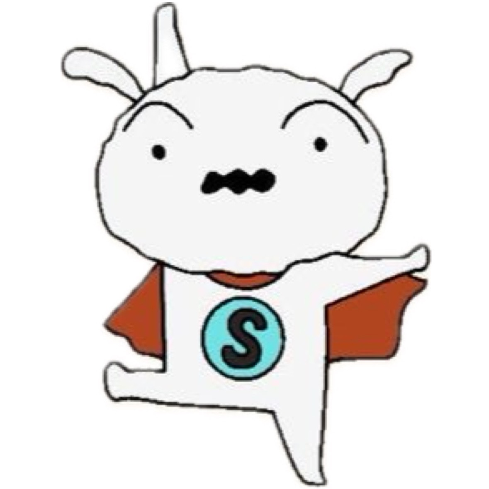

# Level 4. 증권사 자료 기반 주식 LLM 서비스

---

# **프로젝트 개요**

### **프로젝트 주제**

1. 주제
   - 증권사 자료 기반 주식 LLM 서비스 개발
2. 요구사항
   - PDF 문서로부터 텍스트, 그래프 등 정보의 추출
   - 데이터 레포지토리 구축(GraphDB, VectorDB 등)
   - 쿼리에 대해 가장 적합한 데이터를 찾아내는 RAG 시스템 구현
   - 프롬프트 개발
   - 답변 생성
   - Q&A 기능: 정량평가 목적
     - REST API 로 구현
     - Input: query(질의)
     - Output: context(참조텍스트), answer(답변)

### **데이터셋**

1. 제공된 데이터
   - 증권사 자료 파일(PDF) 100개

### **평가 방법**

1. 정량평가 50%
   - 테스트셋 질의에 대한 답변 성능 – 지표 G-Eval
2. 정성평가 50%
   - 서비스의 창의성, 유용성, 개발 완성도, 소스코드 품질, 문서화 수준

<br>

# **👨🏻‍💻 팀원 소개 및 역할**

<div align='center'>

|                                                          이름                                                          |                       프로필                       |                             역할                              |
| :--------------------------------------------------------------------------------------------------------------------: | :------------------------------------------------: | :-----------------------------------------------------------: |
| 권기태 [](https://github.com/starlike6617) | </img> |     API 설계 및 개발, RESTful API 구현, OCR 데이터 후처리     |
|  권유진 [](https://github.com/0618yujin)   | </img> | 평가 데이터 제작, OCR 데이터 후처리, Web Design 및 발표 자료  |
|    박무재 [](https://github.com/Mujae)     | </img> | RAG 파이프라인 구현, 평가 코드 구현 및 실험, 평가 데이터 선별 |
|  박정미 [](https://github.com/imJeongmi)   | </img> |        평가 데이터 제작, OCR 데이터 후처리, Front-end         |
|   이용준 [](https://github.com/elwhyjay)   | </img> |       PM, 리팩토링 및 기타 구현, 아키텍쳐 설계 및 서빙        |
|  정원식 [](https://github.com/wonsjeong)   | </img> |    DocLayout 모듈 구현, Embedding Model, Fine Tuning, 발표    |

</div>
<br>

# 프로젝트 수행 방법

## 1. PDF OCR

📑 **[PDF OCR 상세 설명 보기](PDF_OCR/README.MD)**


```bash
python pdf_parser.py -i "./pdf/input_pdf_folder"
python data_postprocessor.py
```

## 2. RAG

📑 **[RAG 상세 설명 보기](app/RAG/README.md)**

### 2.1 실행

```bash
cd app/RAG

# retrieval 평가
python main.py mode=retrieve

# generator 평가
python main.py mode=generate

# vectordb 생성 및 업데이트
python main.py mode=update_vectordb
```

### 2.2 평가 데이터 구축

- 목적
  - Retriever의 Top-K Accuracy 평가 및 Retriever, Generator의 G-Eval 평가 수행
- 방법
  - **질문 생성**: GPT를 활용하여 PDF에서 각 종목의 증권사마다 text 기반 질문 10개씩 생성
  - **Query 정제**: 각 종목별로 100개의 Query를 생성한 후, 중복을 제거하여 최종 Query 선정
  - **답변 추출**: 정제된 Query를 각 증권사 리포트에 적용하여 answers 도출
  - **Ground Truth 강화**: 종목별로 다양한 증권사(5~6개)를 선정하여 Ground Truth의 품질 향상
  - **표&그림 질문 추가**: 표와 그림을 기반으로 한 질문을 10개 추가 생성
- 활용
  - Retrieval Top-K Accuracy에는 전체 1,843개 활용
  - G-Eval 평가는 1,843개 중 75개 샘플 사용

## 3. API

📑 **[API 상세 설명 보기](app/README.md)**

REST API 개발 (파이썬 API, Query API)

### 3.1 실행

```bash
cd app
uvicorn main:app --reload --host 0.0.0.0 --port 8000
```

### 3.2 Endpoint

- query
- documents
- chatting

## 4. FE

### 4.1 실행

```bash
cd FE
npm install
npm run dev
```

<!-- 영상 재생 안 됨 -->

<video src="images/demo.mov" autoplay muted loop></video>

### 4.2 기능

- AI 모델 선택(GPT-4o, GPT-4o-mini, Clova X)
- 첨부한 PDF 문서를 벡터 DB화하여 효율적인 검색 지원
- 이전 context를 유지한 실시간 대화
- 위젯: 코스피 지수, 실시간 환율, 최신 경제 뉴스, 종목 관련 정보, 종목별 최신 뉴스

<br>

# 결과

### 사용 기술

- **OCR**: DocLayout-Yolo, Clova OCR, Upstage Parser API
- **VectorDB**: ChromaDB
- **Retriever: Langchain**
- **Generator**: Langchain, LLM-based Answering Model (gpt-4o, Clova X)
- **Evaluation**: G-Eval, Top-K Accuracy
- API server: Fastapi
- **Web Front-end**: React.js, Tailwind CSS

### 팀워크 & 협업 경험

- 협업 도구 : Github issue와 discussion으로 task 할당 및 토의 🤝
- Commit 관리 : Github commit message template으로 일관성 유지, 협업 효율 증대 📚

### 프로젝트 진행 방식

- 프로젝트 관리 : Notion에 완료된 일 공유, Zoom meeting을 통해 진행 상황 토의
